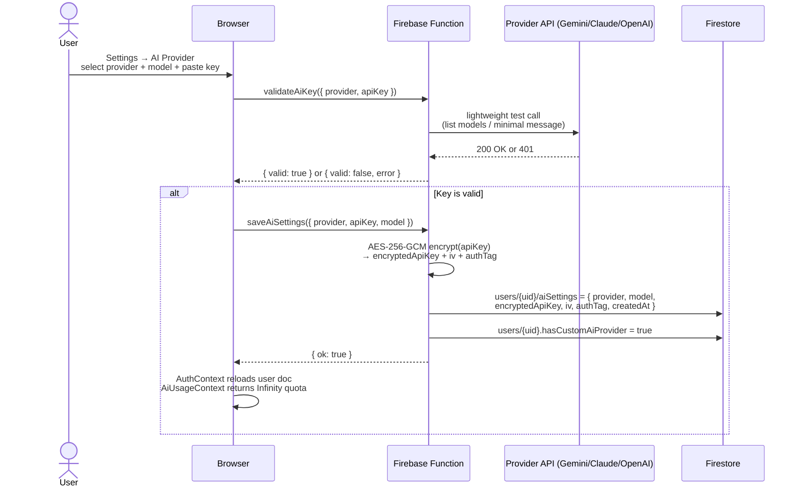
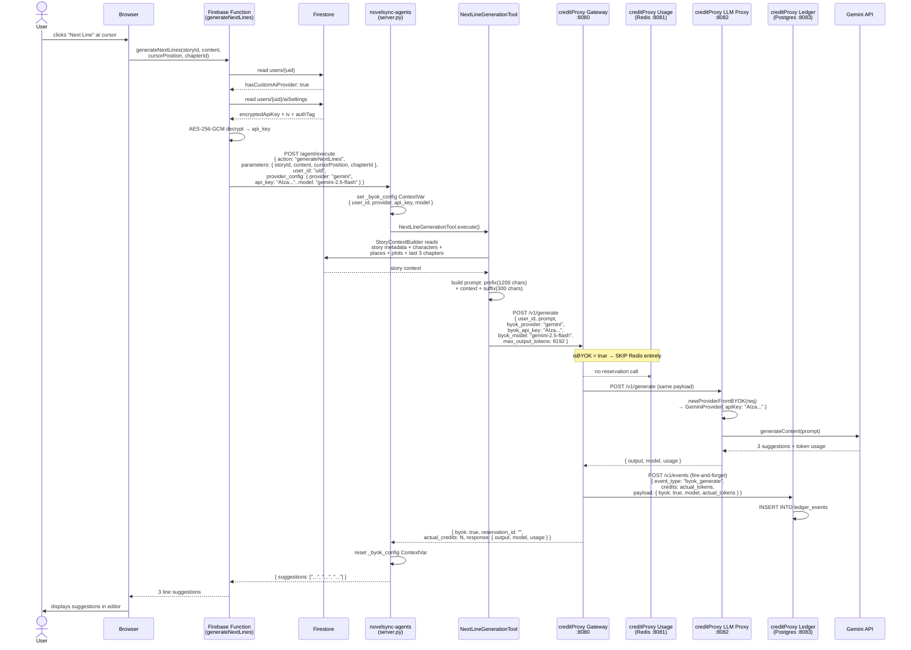
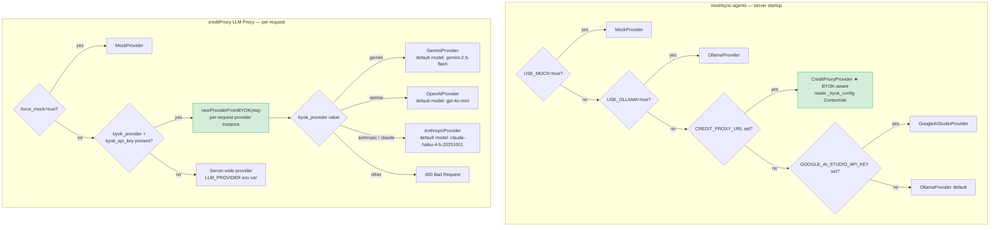
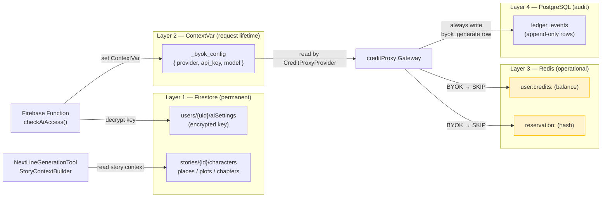
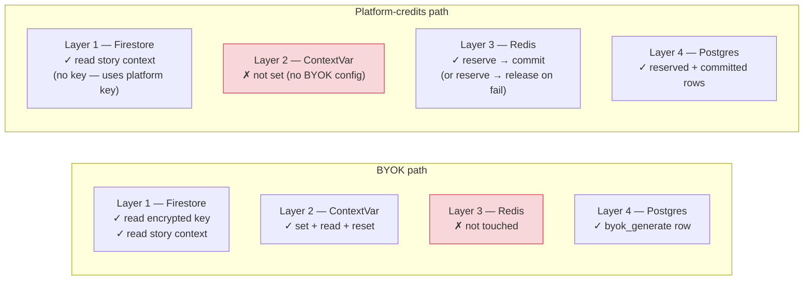

# BYOK (Bring Your Own Key) — Complete Flow Reference

> **Audience:** Non-technical users (Section 1), product/engineers (Sections 2–7).
> **Example feature used throughout:** `generateNextLines` and `generateStoryChoices`.

---

## Section 1 — What Is BYOK? (Plain English)

NovelSync uses AI to help you write. By default, every AI request you make draws from a shared pool of platform credits — think of it like ordering coffee at a café. You get a daily allowance, and once it's gone, you wait until tomorrow.

BYOK lets you bring your own cup. Instead of using platform credits, you paste in your personal API key from Google (Gemini), Anthropic (Claude), or OpenAI. From that point on, every AI request you make goes directly to your chosen provider on your own account — unlimited by NovelSync's daily cap, and billed directly to you by the provider at their standard rates. Your key is encrypted before it ever touches our database. NovelSync never sees it in plaintext after you save it.

---

## Section 2 — One-Time Setup: Saving Your API Key

### How it works

1. Open **Settings → AI Provider** in the NovelSync web app.
2. Choose a provider (Gemini, Claude, or OpenAI) and a model.
3. Paste your API key. Click **Test** — NovelSync makes a lightweight call to the provider to confirm the key is valid before saving anything.
4. Click **Save**. Your key is encrypted with AES-256-GCM (a random 12-byte salt is generated each time, so two saves of the same key produce different ciphertext) and stored in Firebase.
5. A flag `hasCustomAiProvider: true` is written to your user record. This is what the app reads to decide whether to show you "Unlimited" instead of a daily quota.

### Diagram A — Key Setup Flow



### What is written to Firestore

```
users/{uid}
  hasCustomAiProvider: true              ← read by AuthContext on every page load

  aiSettings:
    provider:          "gemini"          ← "gemini" | "claude" | "openai"
    model:             "gemini-2.5-flash"
    encryptedApiKey:   "<base64>"        ← AES-256-GCM ciphertext, never plaintext
    iv:                "<base64>"        ← 12-byte random IV, unique per save
    authTag:           "<base64>"        ← GCM authentication tag
    createdAt:         Timestamp
```

### Key source files

| File | Role |
|------|------|
| `novelsync-frontend/src/routes/Settings/AiSettings.tsx` | UI — provider selector, key input, test + save buttons |
| `functions/src/aiSettingsEndpoints.ts` | Firebase Functions — `validateAiKey`, `saveAiSettings`, `deleteAiSettings` |
| `functions/src/aiSettings.ts` → `setUserAiSettings()` | Encryption + Firestore write |
| `novelsync-frontend/src/contexts/AuthContext.tsx` | Reads `hasCustomAiProvider` on login/reload |
| `novelsync-frontend/src/contexts/AiUsageContext.tsx` | `canUseAI()` returns `true` unconditionally for BYOK users |

---

## Section 3 — Using an AI Feature: generateNextLines

### How it works (step by step)

When you click **Next Line** in the story editor, here is every hop the request takes:

1. **Browser** sends cursor position, surrounding text, and story/chapter IDs to a Firebase Function.
2. **Firebase Function** calls `checkAiAccess(userId)`:
   - Sees `hasCustomAiProvider: true` on your user record.
   - Decrypts your API key from `users/{uid}/aiSettings`.
   - Returns `{ allowed: true, byok: true, providerConfig: { provider, api_key, model } }`.
   - No quota counter is incremented.
3. **Firebase Function** forwards everything — including your decrypted key — to the novelsync-agents Python service.
4. **novelsync-agents** stores your key in a Python `ContextVar` (an async-safe per-request slot in memory) and runs the `NextLineGenerationTool`.
5. **NextLineGenerationTool** reads your story's characters, places, plots, and last 3 chapters from Firestore. It builds a prompt using the 1 200 characters before your cursor and 300 characters after.
6. The tool calls **creditProxy** with your key attached.
7. **creditProxy Gateway** sees your key is present → skips the Redis credit reservation entirely → routes to **creditProxy LLM Proxy**.
8. **LLM Proxy** instantiates a fresh Gemini (or Claude/OpenAI) client using your key for this request only.
9. The provider returns 3 line suggestions.
10. creditProxy writes one audit row to PostgreSQL (`byok_generate` event) then returns the result back up the chain.
11. The editor displays your 3 suggestions.

### Diagram B — End-to-End Request Flow



### Diagram C — Provider Selection Decision Trees



> **Important:** Only `CreditProxyProvider` is BYOK-aware. If `CREDIT_PROXY_URL` is not set in the agents environment, `provider_config` is accepted in the request but silently ignored — the next provider in the fallback chain is used instead.

---

## Section 4 — The 4 Memory Layers

Every BYOK request flows through four distinct memory layers. Each has a different scope, lifetime, and purpose.

### Layer Overview

| # | Layer | Store | What lives here | Lifetime |
|---|-------|-------|-----------------|----------|
| 1 | User & Story State | **Firebase Firestore** | Encrypted BYOK key, story content (characters / places / plots / chapters), job status, `aiUsage` counter | Permanent |
| 2 | Per-Request Context | **Python ContextVar** (`_byok_config`) | Decrypted provider + api_key + model for one in-flight request | Single async request only — reset in `finally` block |
| 3 | Credit Operational State | **Redis** | Credit balance (`user:credits:<uid>`), reservation hash (`reservation:<resID>`) | Balance: permanent; Reservation: 120 s → 24 h TTL after commit/release |
| 4 | Audit Ledger | **PostgreSQL** (`ledger_events`) | Append-only row per credit event or BYOK call | Permanent |

### Diagram D — How the 4 Layers Interact



**Key insight:** On a BYOK request, Layer 3 (Redis) is never touched. The user's credit balance is unchanged. Layer 2 exists only for the duration of the HTTP request — it is async-safe and isolated between concurrent users. Layer 4 always receives an audit row regardless of BYOK or platform mode.

### Platform-credit vs BYOK — layers touched



---

## Section 5 — What Is Stored Where (Storage Reference)

### Firebase Firestore

```
users/{uid}
  hasCustomAiProvider:  boolean          ← BYOK flag; read by AuthContext + AiUsageContext
  aiUsage:              number           ← platform users only; incremented per AI call
  lastAiUsageDate:      string (UTC)     ← date of last aiUsage increment; resets counter daily

  aiSettings:                            ← absent if BYOK never configured
    provider:           "gemini" | "claude" | "openai"
    model:              string
    encryptedApiKey:    string  (base64, AES-256-GCM ciphertext)
    iv:                 string  (base64, 12-byte random IV)
    authTag:            string  (base64, GCM auth tag)
    createdAt:          Timestamp

stories/{storyId}
  title, genre, tone, description

  characters/{id}:  name, role, backstory, traits, motivations
  places/{id}:      name, description, atmosphere
  plots/{id}:       title, description, type, events[{ name, content }]
  chapters/{id}:    title, content, chapterNumber

jobs/{jobId}                             ← async generation jobs (story/chapter gen)
  status:   "queued" | "processing" | "completed" | "failed"
  result:   ...
  storyId, userId, createdAt
```

### Redis — creditProxy Usage service (:8081)

```
user:credits:<userID>           STRING    integer credit balance
                                          ops: INCRBY (purchase), DECRBY (reserve)

reservation:<reservationID>     HASH      { user_id, amount, status }
                                          status: "reserved" | "committed" | "released"
                                          TTL: 120 s on creation
                                               86 400 s (24 h) after commit or release
```

All reservation mutations (reserve / commit / release) run as **atomic Lua scripts** — no race conditions possible even under concurrent requests.

> BYOK requests **never write to Redis.** No reservation is created; no balance is touched.

### PostgreSQL — creditProxy Ledger service (:8083)

```sql
CREATE TABLE ledger_events (
  id              BIGSERIAL PRIMARY KEY,
  idempotency_key TEXT NOT NULL UNIQUE,    -- "<idem_key>:reserve|commit|release|commit_failed"
  user_id         TEXT NOT NULL,
  reservation_id  TEXT,                   -- empty string for BYOK rows
  event_type      TEXT NOT NULL,
  credits         BIGINT NOT NULL,        -- tokens involved (reserved or actual)
  payload         JSONB NOT NULL DEFAULT '{}',
  created_at      TIMESTAMPTZ NOT NULL DEFAULT NOW()
);

-- Query index
CREATE INDEX idx_ledger_events_user_created_at
  ON ledger_events(user_id, created_at DESC);
```

**Event types written per call:**

| event_type | When | reservation_id | credits | payload highlights |
|---|---|---|---|---|
| `credits_reserved` | Platform: reservation created | `res_...` | estimated tokens | `{ prompt_tokens, estimated_total_tokens }` |
| `credits_released` | Platform: LLM failed | `res_...` | estimated tokens | `{ reason: "llm_failure" }` |
| `credits_committed` | Platform: LLM succeeded | `res_...` | actual tokens | `{ estimated_credits, actual_tokens, model, byok: false }` |
| `commit_failed` | Platform: commit step failed | `res_...` | actual tokens | `{ error: "..." }` |
| `byok_generate` | **BYOK: any successful call** | `""` | actual tokens | `{ byok: true, model, actual_tokens }` |

Idempotency is enforced via `ON CONFLICT (idempotency_key) DO UPDATE SET credits = EXCLUDED.credits` — replaying the same key is a safe no-op.

---

## Section 6 — generateStoryChoices Variation

`generateStoryChoices` follows the identical BYOK routing path. The only differences are:

| Aspect | generateNextLines | generateStoryChoices |
|--------|-------------------|----------------------|
| Agent action | `"generateNextLines"` | `"generateStoryChoices"` |
| Tool class | `NextLineGenerationTool` | `StoryChoicesTool` |
| Firebase Function | `functions/src/generateNextLines.ts` | `functions/src/generateStoryChoices.ts` |
| Generation method | `generate_structured_content()` with JSON schema | `generate_content_async()` → parse JSON from text |
| Input | cursor prefix/suffix (micro context) | full chapter content + mode flag |
| Modes | — | `opening` / `continuation` / `ending` |
| Response shape | `{ suggestions: [str, str, str] }` | `{ openingScene?: str, choices: [{ label, sceneText, isFinal? }] }` |

Everything else — BYOK ContextVar, credit skip, `byok_generate` ledger row, provider decision tree — is identical.

---

## Section 7 — End-to-End Testing Plan

### Pre-conditions checklist

```
[ ] Firebase emulator running
      cd novelsync-frontend && firebase emulators:start

[ ] creditProxy full stack running
      cd creditProxy && docker compose up --build
      Verify: gateway :8080, usage :8081, llmproxy :8082, ledger :8083

[ ] novelsync-agents running with BYOK-capable config
      CREDIT_PROXY_URL=http://localhost:8080
      USE_MOCK=false
      (do NOT set USE_OLLAMA or GOOGLE_AI_STUDIO_API_KEY — forces CreditProxy path)
      cd novelsync-agents && source venv/bin/activate && python server.py

[ ] Valid Gemini API key available for BYOK tests

[ ] Firestore emulator seeded: one test user doc + one story with characters/chapters
```

---

### Phase 1 — API Key Save & Retrieve

| # | Action | How to run | Expected result |
|---|--------|-----------|-----------------|
| 1.1 | Validate a good key | `callFunction("validateAiKey", { provider: "gemini", apiKey: "<real-key>" })` | `{ valid: true }` |
| 1.2 | Validate a bad key | same but garbage key | `{ valid: false, error: "..." }` |
| 1.3 | Save settings | `callFunction("saveAiSettings", { provider: "gemini", apiKey: "<real-key>", model: "gemini-2.5-flash" })` | 200 OK; Firestore `users/{uid}/aiSettings` written; `hasCustomAiProvider: true` |
| 1.4 | Confirm encryption | Read `users/{uid}/aiSettings.encryptedApiKey` directly from Firestore | Value is base64, **not** the raw key |
| 1.5 | Confirm decryption | Call `getUserAiSettings(uid)` inside Firebase Functions shell | Decrypted `api_key` matches original |
| 1.6 | Delete settings | `callFunction("deleteAiSettings", {})` | `aiSettings` field removed; `hasCustomAiProvider: false` |

---

### Phase 2 — checkAiAccess Routing

| # | Action | Expected |
|---|--------|---------|
| 2.1 | `checkAiAccess(uid)` — BYOK user | `{ allowed: true, byok: true, providerConfig: { provider, api_key, model } }` |
| 2.2 | `checkAiAccess(uid)` — no BYOK | `{ allowed: true/false, byok: false, providerConfig: null }` + quota check runs |
| 2.3 | Platform user at daily limit (aiUsage ≥ 10, same date) | `{ allowed: false }` — function returns 403 |
| 2.4 | BYOK user with aiUsage ≥ 10 | `{ allowed: true }` — quota never checked for BYOK |

---

### Phase 3 — creditProxy Gateway (curl / httpie)

| # | Request | Expected |
|---|---------|---------|
| 3.1 | `POST :8080/v1/generate` — valid BYOK | `{ byok: true, reservation_id: "", actual_credits: N > 0, response: { output, model, usage } }` |
| 3.2 | Check Redis after 3.1 | `redis-cli KEYS 'reservation:*'` — no new keys for this user |
| 3.3 | Check Postgres after 3.1 | `SELECT * FROM ledger_events WHERE user_id='uid' ORDER BY id DESC LIMIT 1` — one `byok_generate` row, `reservation_id = ''`, `payload->>'byok' = 'true'` |
| 3.4 | Invalid `byok_provider` | `byok_provider: "ollama"` → 400 `invalid byok config: unknown byok_provider "ollama"` |
| 3.5 | Valid provider, wrong key | `byok_provider: "gemini", byok_api_key: "bad"` → 502 (Gemini 401 propagates) |
| 3.6 | Platform path (no BYOK fields) | `reservation:*` key appears in Redis; Postgres gets `credits_reserved` then `credits_committed`; response `byok: false` |
| 3.7 | Repeat 3.6 same `idempotency_key` | Postgres row count unchanged — upsert is no-op |
| 3.8 | Omit `byok_model` with `byok_provider: "gemini"` | Response `model` field = `"gemini-2.5-flash"` (default applied) |
| 3.9 | Omit `byok_model` with `byok_provider: "anthropic"` | Response `model` field = `"claude-haiku-4-5-20251001"` |

**Sample curl for 3.1:**
```bash
curl -s -X POST http://localhost:8080/v1/generate \
  -H "Content-Type: application/json" \
  -d '{
    "user_id": "test-user-1",
    "prompt": "Write the next sentence of a fantasy novel.",
    "max_output_tokens": 100,
    "byok_provider": "gemini",
    "byok_api_key": "AIza...",
    "byok_model": "gemini-2.5-flash"
  }' | jq .
```

---

### Phase 4 — novelsync-agents BYOK Routing

| # | Request to `/agent/execute` | Expected |
|---|---------------------------|---------|
| 4.1 | `action: generateNextLines` — no `provider_config` | Uses server-wide provider (mock if `LLM_MOCK_MODE=true`) |
| 4.2 | `action: generateNextLines` — with `provider_config` | `_byok_config` ContextVar set; CreditProxy call includes `byok_*` fields; response has `suggestions: [str, str, str]` |
| 4.3 | Two simultaneous requests — different users, different BYOK keys | Each request gets its own ContextVar copy; check Postgres `model` column — no cross-contamination |
| 4.4 | `action: generateStoryChoices` — with `provider_config` | Returns `choices[]`; Postgres gets `byok_generate` row |
| 4.5 | `action: generateNextLines` — `provider_config` set but `CREDIT_PROXY_URL` unset | BYOK silently ignored; uses next provider in chain |

**Sample curl for 4.2:**
```bash
curl -s -X POST http://localhost:8000/agent/execute \
  -H "Content-Type: application/json" \
  -d '{
    "action": "generateNextLines",
    "parameters": {
      "storyId": "story-abc",
      "content": "<p>The door creaked open.</p>",
      "cursorPosition": 28,
      "chapterId": "ch-1"
    },
    "user_id": "test-user-1",
    "provider_config": {
      "provider": "gemini",
      "api_key": "AIza...",
      "model": "gemini-2.5-flash"
    }
  }' | jq .
```

---

### Phase 5 — Full UI Flow (manual walkthrough)

| # | Action | What to check |
|---|--------|--------------|
| 5.1 | Log in as test user (no BYOK) | AiUsageContext shows platform quota (e.g. "8/10 remaining") |
| 5.2 | Settings → AI Provider → enter valid Gemini key → Test → Save | Success toast; Firestore `hasCustomAiProvider: true` |
| 5.3 | Refresh page | `hasCustomAiProvider` still `true`; quota UI shows "Unlimited" |
| 5.4 | Open a story → editor → click "Next Line" | 3 suggestions appear; no 402 or 403 |
| 5.5 | Check Postgres | `byok_generate` row for this user, `reservation_id = ''` |
| 5.6 | Check Redis | `redis-cli KEYS 'reservation:*'` — no reservation created |
| 5.7 | Click AI Choices in the editor | Choices panel opens with options; same Postgres pattern |
| 5.8 | Settings → Remove API key | `hasCustomAiProvider: false`; UI quota reverts to platform limit |
| 5.9 | Click "Next Line" after removal | Platform credits used; Redis reservation created; `credits_committed` in Postgres |

---

### Common Failure Modes & What to Look For

| Symptom | Likely cause | How to diagnose |
|---------|-------------|-----------------|
| Raw API key visible in Firestore | Encryption skipped | Check `aiSettings.encryptedApiKey` — must be base64, ~44+ chars |
| Two concurrent BYOK users getting each other's provider | ContextVar not reset | Check Phase 4 test 4.3; inspect Postgres `model` field per user |
| Redis reservation created on a BYOK call | Gateway BYOK detection broken | `isBYOK` flag requires **both** `byok_provider` AND `byok_api_key` non-empty |
| BYOK config ignored (agents using wrong provider) | `CREDIT_PROXY_URL` not set | Check agents env; CreditProxy is the only BYOK-aware provider |
| `actual_credits` in response doesn't match `usage.total_tokens` | Token estimation mismatch | `pkg/tokens: ceil(len/4)` — expected; not exact tokenizer |
| 502 on valid BYOK key | Key valid but wrong model name | Omit `byok_model` to use provider default; or confirm model name spelling |
| Duplicate ledger rows | Idempotency key collision | Confirm `idempotency_key` is unique per call; gateway auto-generates if omitted |
| BYOK users still hitting quota | `hasCustomAiProvider` not set | Re-save API key; confirm `saveAiSettings` Function wrote the flag |
